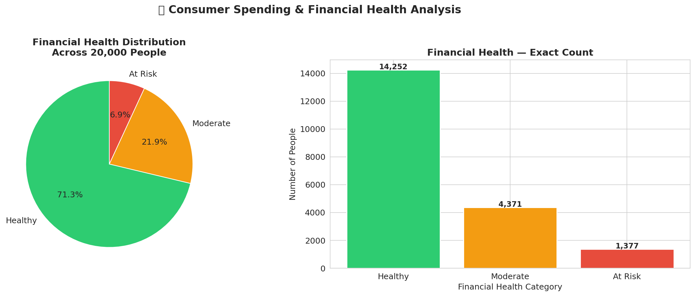
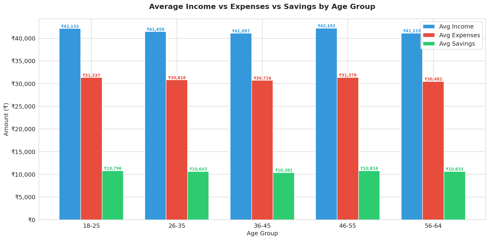
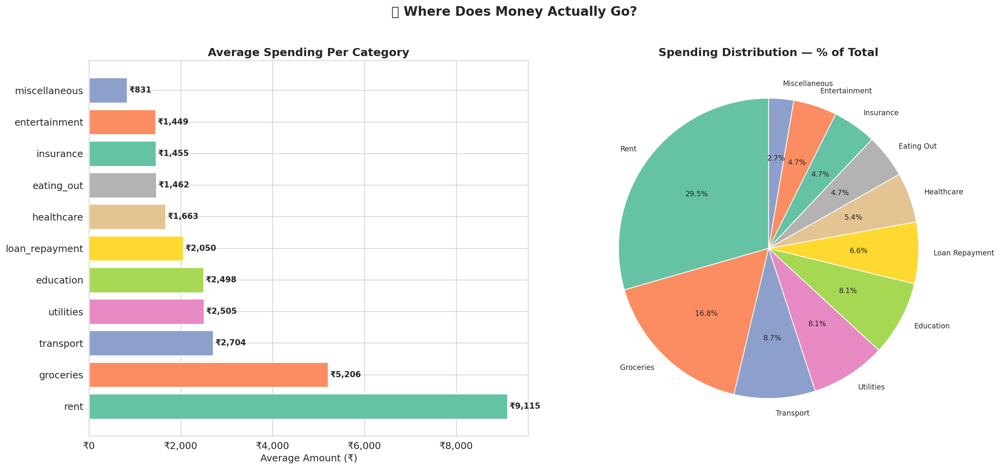
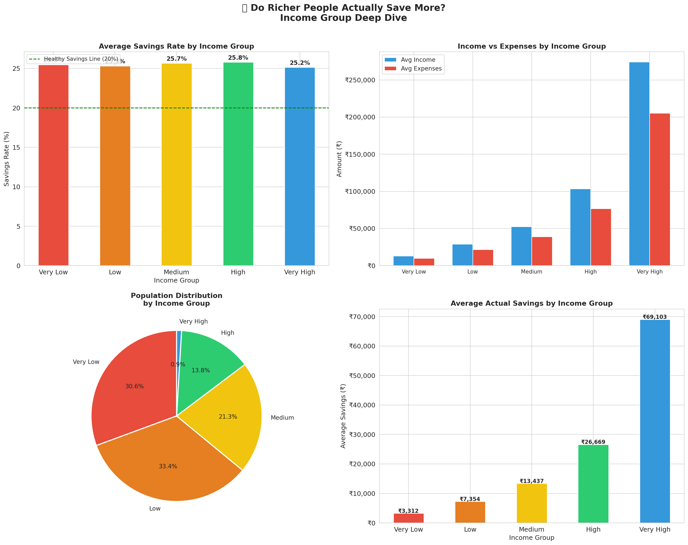
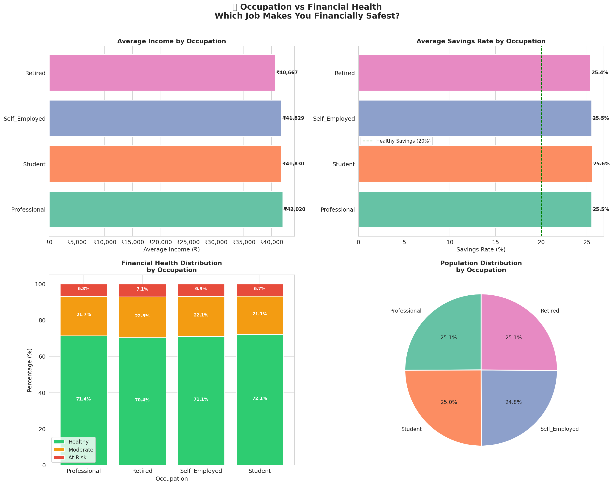
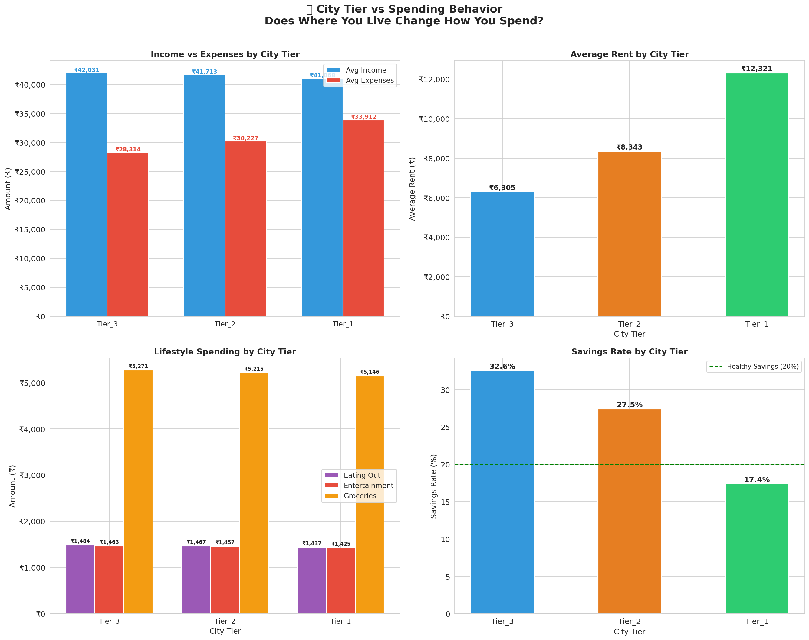
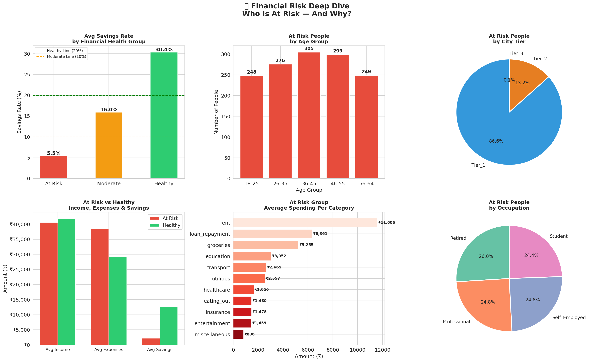
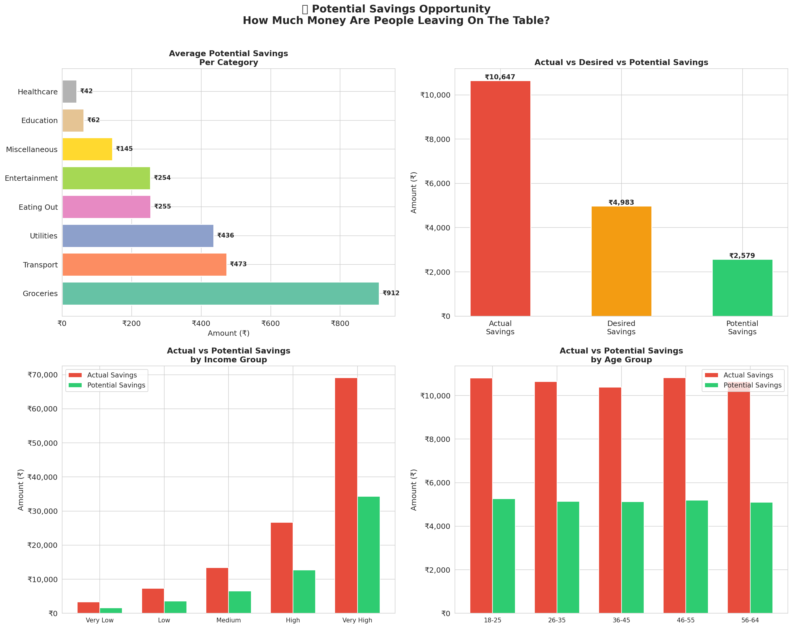

# 💰 Consumer Spending & Financial Health Analysis


---

## 📌 Project Overview

As someone deeply interested in personal finance,
I always wondered — where does money actually go?
Do people earn more but save less? Does age change
the way we spend? Does living in a big city make
you wealthier?

This project is my attempt to answer these questions
using real data — not assumptions. I analyzed 20,000
real financial records to uncover spending patterns,
identify financially vulnerable groups and find
actionable savings opportunities.

This is not just a portfolio project. It is proof
that I can take raw, messy data and turn it into
decisions that matter.

---

## 🎯 Business Questions Answered

- Do richer people actually save a higher percentage?
- Which age group is most financially vulnerable?
- Does living in a big city make you wealthier?
- Is financial risk caused by low income or poor
  spending habits?
- Which spending category has the biggest savings
  opportunity?
- Does your occupation determine your financial health?
- How much collective savings potential sits untapped?
- Are people saving more or less than they want to?

---

## 🔍 6 Headline Insights

> **1. The 25% Rule**
> Every income group saves almost exactly 25%
> regardless of earnings — from ₹13,000 to
> ₹2,74,000 earners. Lifestyle inflation perfectly
> absorbs every income increase.

> **2. The City Trap**
> All three city tiers earn nearly identical incomes
> (~₹41,000). But Tier 1 rent (₹12,321) is double
> Tier 3 rent (₹6,305). This single difference drops
> the savings rate from 32.6% to just 17.4%.
> Living in a big city does not make you richer —
> it makes your landlord richer.

> **3. The Age Paradox**
> Age 36-45 struggles most financially despite being
> peak career years. Loans, children and lifestyle
> upgrades all hit simultaneously at this life stage.

> **4. Risk Is A Spending Problem — Not Income**
> At-risk people earn only ₹1,296 less than healthy
> people. But they spend ₹9,222 MORE every month.
> Financial risk is entirely driven by spending
> behavior — not earnings level.

> **5. The Grocery Opportunity**
> Groceries has the biggest untapped savings potential
> at ₹912 per person per month. If all 20,000 people
> optimized — over ₹5.1 crore could be unlocked.

> **6. Occupation Does Not Matter**
> All four occupations earn and save at nearly
> identical rates. Your job title does not determine
> your financial health. Your spending habits do.

---

## 📊 Project Visuals

### Financial Health Distribution


### Income vs Expenses vs Savings by Age Group


### Where Does Money Actually Go?


### Income Group vs Savings Rate


### Occupation vs Financial Health


### City Tier vs Spending Behavior


### Financial Risk Deep Dive


### Potential Savings Opportunity


---

## 🗂️ Dataset

| Detail | Info |
|---|---|
| Source | Kaggle — Indian Personal Finance & Spending Habits |
| Rows | 20,000 real-world financial records |
| Original Columns | 27 |
| After Feature Engineering | 34 |
| Missing Values | Zero |
| Income Range | ₹1,301 to ₹10,79,728 |
| Age Range | 18 to 64 years |
| Occupations | Professional, Student, Self-Employed, Retired |
| City Tiers | Tier 1, Tier 2, Tier 3 |

---

## 🛠️ Tools Used

| Tool | Purpose |
|---|---|
| Python (Google Colab) | Data cleaning, EDA, visualization |
| SQL (SQLite Online) | Business queries and analysis |
| Microsoft Excel | Dashboard and presentation |

---

## 📁 Project Structure

```
consumer-spending-financial-analysis/
│
├── README.md
│
├── data/
│   └── finance_clean.csv
│
├── python/
│   └── Consumer_Spending_Financial_Health_Analysis.ipynb
│
├── sql/
│   ├── queries.sql

├── dashboard/
│   └── Consumer_Spending_Financial_Health_Dashboard.xlsx
│
└── images/
    ├── chart1_financial_health.png
    ├── chart2_income_expenses_savings_age.png
    ├── chart3_spending_breakdown.png
    ├── chart4_income_vs_savings.png
    ├── chart5_occupation_financial_health.png
    ├── chart6_city_tier_spending.png
    ├── chart7_financial_risk_deepdive.png
    └── chart8_potential_savings.png
```

---

## 🐍 Phase 1 — Python Analysis

**Notebook:**
`python/Consumer_Spending_Financial_Health_Analysis.ipynb`

### Data Cleaning & Feature Engineering

Starting with 27 raw columns I engineered
7 new meaningful features:

| New Feature | Description |
|---|---|
| age_group | 5 age brackets (18-25 to 56-64) |
| income_group | 5 income levels (Very Low to Very High) |
| total_expenses | Sum of all 11 expense categories |
| actual_savings | Income minus total expenses |
| savings_rate | Actual savings as % of income |
| financial_health | Healthy / Moderate / At Risk classification |
| total_potential_savings | Sum of all potential saving columns |

### 8 Analytical Charts

| Chart | Business Question |
|---|---|
| Chart 1 | What is the financial health distribution? |
| Chart 2 | How do income, expenses and savings vary by age? |
| Chart 3 | Where does money actually go? |
| Chart 4 | Do richer people save more? |
| Chart 5 | Which occupation is financially safest? |
| Chart 6 | Does city tier affect your finances? |
| Chart 7 | Who is at risk — and why? |
| Chart 8 | How much savings potential is untapped? |

---

## 🗄️ Phase 2 — SQL Analysis

**File:** `sql/queries.sql`

### 10 Queries Covering Full SQL Skillset

| Query | Skill | Business Question |
|---|---|---|
| Query 1 | GROUP BY, Aggregations | Financial health overview |
| Query 2 | UNION ALL, ORDER BY | Top spending categories |
| Query 3 | CASE WHEN | Spending behavior classification |
| Query 4 | HAVING clause | High risk segment detection |
| Query 5 | Subquery | Above average earners analysis |
| Query 6 | Multiple aggregations | City tier financial report |
| Query 7 | CTE | Age group performance analysis |
| Query 8 | RANK() Window Function | Financial performance ranking |
| Query 9 | LAG() Window Function | Income group progression |
| Query 10 | CTE + Window + CASE | Complete intelligence report |

### Sample Query — Window Function (Query 8)

```sql
WITH ranked_people AS (
    SELECT
        age_group,
        occupation,
        ROUND(savings_rate, 1) AS Savings_Rate,
        RANK() OVER (
            PARTITION BY age_group
            ORDER BY savings_rate DESC
        ) AS Rank_In_Age_Group,
        NTILE(4) OVER (
            PARTITION BY age_group
            ORDER BY savings_rate DESC
        ) AS Quartile
    FROM finance
)
SELECT * FROM ranked_people
WHERE Rank_In_Age_Group <= 5
ORDER BY age_group, Rank_In_Age_Group;
```

---

## 📊 Phase 3 — Excel Dashboard

**File:** `dashboard/Consumer_Spending_Financial_Health_Dashboard.xlsx`

### 6-Sheet Professional Dashboard

| Sheet | Content |
|---|---|
| Executive Summary | Complete project overview + key metrics |
| Financial Health | Health distribution analysis |
| Age Group Analysis | Income, expenses, savings by age |
| City Tier Analysis | Location impact on finances |
| Spending Breakdown | Category by category analysis |
| Raw Data | Complete clean dataset |

---

## 💡 Key Technical Skills Demonstrated

**Python**
- pandas — data manipulation and groupby analysis
- numpy — numerical operations
- matplotlib and seaborn — 8 professional charts
- Feature engineering — 7 derived variables
- EDA — full exploratory analysis on 20,000 rows

**SQL**
- GROUP BY with multiple aggregations
- CASE WHEN multi-dimensional classification
- HAVING clause for group-level filtering
- Subqueries — scalar and table level
- CTEs — multi-step analysis pipelines
- Window functions — RANK, LAG, NTILE, COUNT OVER
- Conditional aggregations inside SELECT

**Microsoft Excel**
- Cross-sheet AVERAGE formula references
- Dynamic percentage calculations
- Professional chart creation
- Conditional formatting
- 6-sheet dashboard design

---

## ▶️ How To Run This Project

**Python Notebook:**
```
1. Open Google Colab
2. Upload finance_clean.csv from data/ folder
3. Run all cells in order
4. All 8 charts generate automatically
```

**SQL Queries:**
```
1. Go to sqliteonline.com
2. Import finance_clean.csv
3. Copy queries from sql/queries.sql
4. Run each query and compare with results/
```

**Dashboard:**
```
1. Download dashboard xlsx file
2. Open in Excel or Google Sheets
3. All charts and formulas load automatically
```

---

## 👤 About This Project

I built this project to prove that data analysis
is not just about cleaning data and making charts.
It is about asking the right questions and finding
answers that actually matter to real people and
real businesses.

Every insight here came from a genuine question
about financial behavior. The data gave honest —
and often surprising — answers.

**Built by:** Omer Bin Wahid Latifi
**Role:** Aspiring Data Analyst
**Location:** United Kingdom
**LinkedIn:** https://www.linkedin.com/in/omer-latifi/
**Dataset:** [Kaggle — Indian Personal Finance](https://www.kaggle.com/datasets/shriyashjagtap/indian-personal-finance-and-spending-habits)
